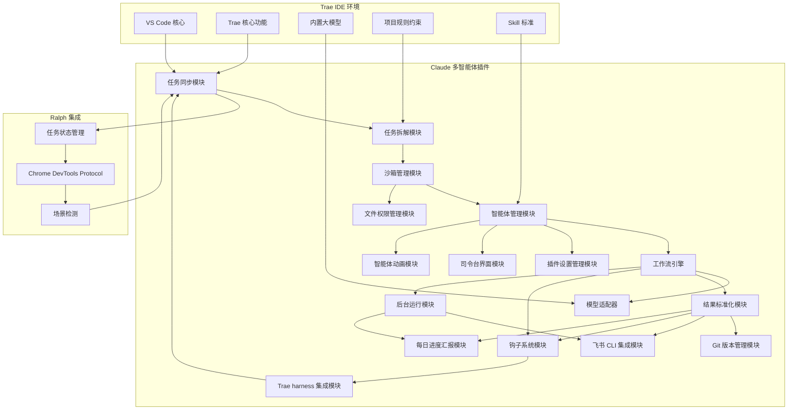
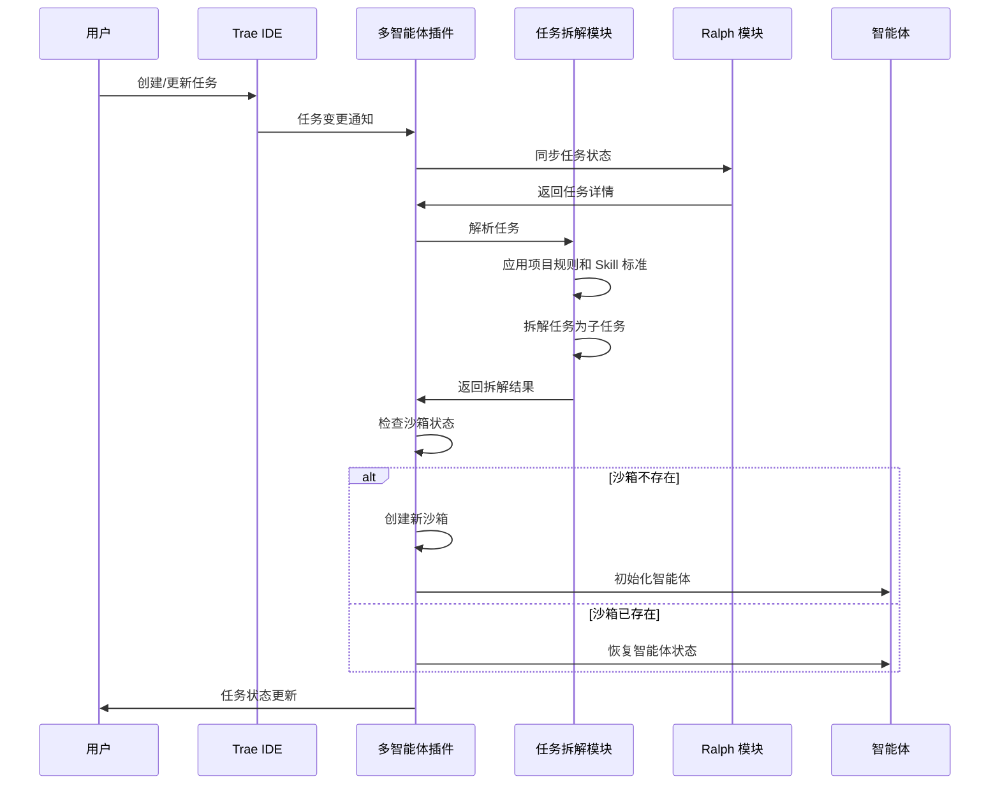
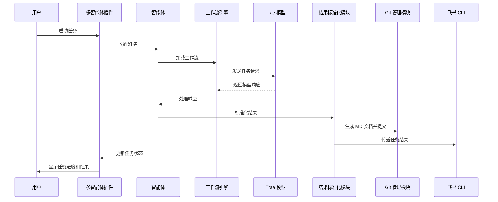
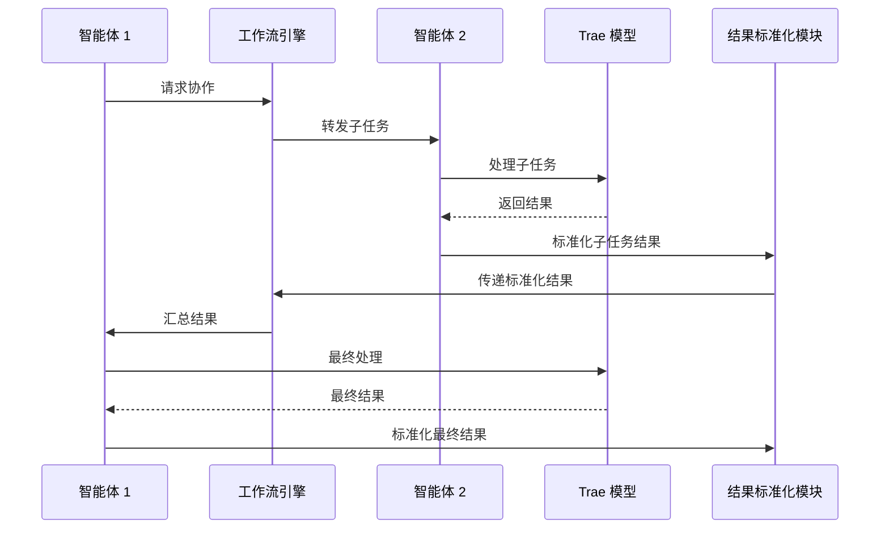
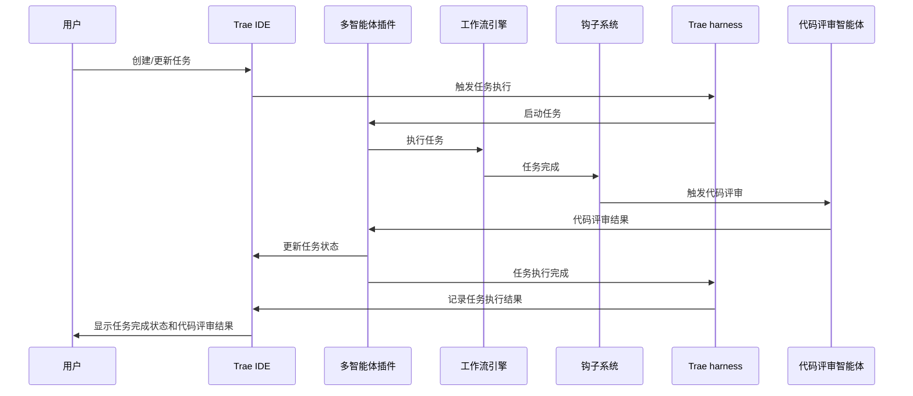
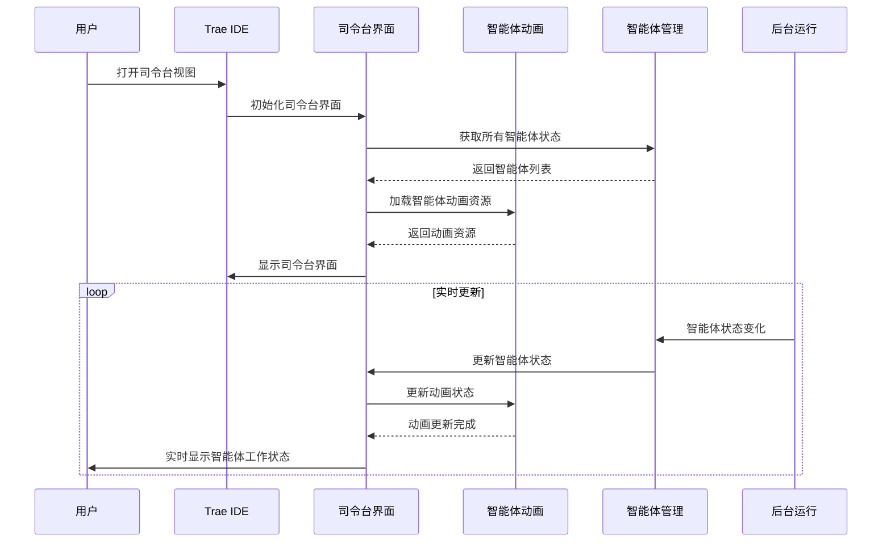
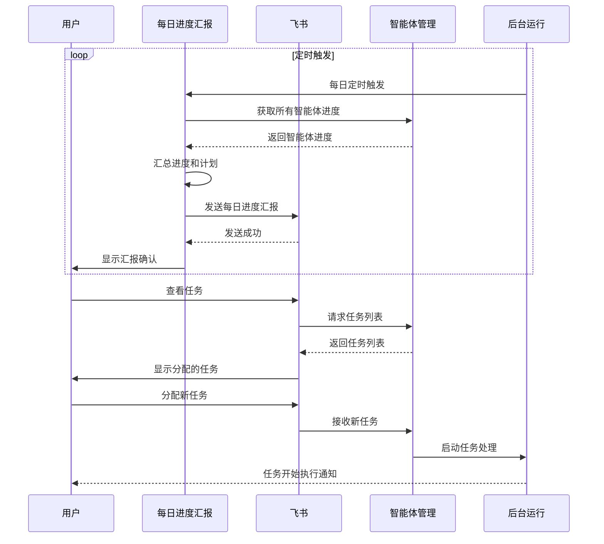

# Trae Claude 多智能体插件设计文档

## 1. 项目概述

### 1.1 项目背景

Trae IDE 是一款基于 VS Code 的智能开发环境，内置了强大的 AI 能力。Ralph 是一个为 Trae IDE 设计的自动化工具，通过 Chrome DevTools Protocol 实现持续工作。Claude Code 是 Anthropic 开发的 AI 编码助手，具有强大的代码理解和生成能力。

### 1.2 项目目标

本项目旨在基于 Ralph 二次开发，将 Claude Code 的工作流理念集成到 Trae IDE 中，创建一个多智能体插件，实现以下目标：

- 实时同步 Trae IDE 的任务列表
- 为每个 Trae 任务创建隔离的沙箱环境
- 每个任务分配独立的智能体
- 利用 Claude 工作流实现多智能体协作
- 白嫖 Trae 内置大模型的能力
- 充分利用 Trae 的项目规则约束和 skill 标准
- 控制 Trae IDE 读取任务，智能拆解任务
- 输出结果标准化，便于管理和追踪
- 通过 MD 文档进行 Git 版本管理
- 集成飞书 CLI 传递任务
- 实现文件独立权限，确保任务间互不干扰
- 提供 VS Code 插件设置页面，配置各智能体参数
- 实现钩子能力，参考 Claude 源码实现任务结束触发代码评审等功能
- 集成 Trae harness 自动化任务执行触发
- **打造司令台界面**：集中展示所有智能体的工作状态
- **智能体动画展示**：为每个智能体添加动画人物形象，展示工作状态
- **24/7 智能体工作**：智能体持续工作，互不干扰
- **飞书任务管理**：通过飞书查看分配的任务
- **每日计划和进度汇报**：智能体每天汇报工作进度和计划

### 1.3 目标用户

- 软件开发人员
- AI 辅助编程爱好者
- 需要高效完成复杂开发任务的团队

## 2. 功能需求

### 2.1 核心功能

| 功能模块 | 功能描述 | 优先级 |
|---------|---------|--------|
| 任务同步 | 实时监控并同步 Trae IDE 的任务列表 | 高 |
| 沙箱管理 | 为每个任务创建和管理隔离的沙箱环境 | 高 |
| 智能体分配 | 为每个任务分配独立的智能体实例 | 高 |
| 多智能体协作 | 实现智能体之间的通信和协作 | 中 |
| 工作流管理 | 基于 Claude 工作流模式管理任务执行 | 中 |
| 模型能力利用 | 充分利用 Trae 内置大模型的能力 | 高 |
| 规则约束集成 | 利用 Trae 的项目规则约束和 skill 标准 | 高 |
| 任务拆解 | 智能拆解复杂任务为子任务 | 高 |
| 结果标准化 | 标准化输出结果格式 | 高 |
| Git 版本管理 | 通过 MD 文档进行 Git 版本管理 | 中 |
| 飞书集成 | 集成飞书 CLI 传递任务 | 中 |
| 文件权限管理 | 实现文件独立权限，确保任务间互不干扰 | 高 |
| 插件设置 | 提供 VS Code 插件设置页面，配置智能体参数 | 高 |
| 钩子系统 | 实现任务生命周期钩子，支持任务结束触发代码评审等功能 | 高 |
| Trae harness 集成 | 集成 Trae harness 自动化任务执行触发 | 高 |
| 司令台界面 | 集中展示所有智能体的工作状态，提供全局监控视图 | 高 |
| 智能体动画 | 为每个智能体添加动画人物形象，直观展示工作状态 | 高 |
| 24/7 智能体运行 | 智能体持续工作，后台自动处理任务 | 高 |
| 飞书任务查看 | 通过飞书查看分配给各智能体的任务 | 高 |
| 每日进度汇报 | 智能体每天自动汇报工作进度和计划 | 高 |

### 2.2 次要功能

| 功能模块 | 功能描述 | 优先级 |
|---------|---------|--------|
| 任务状态追踪 | 实时追踪每个任务的执行状态 | 中 |
| 智能体配置 | 允许用户配置智能体的行为和能力 | 中 |
| 工作流模板 | 提供预设的工作流模板 | 低 |
| 性能监控 | 监控智能体和沙箱的性能 | 低 |
| 日志管理 | 统一管理智能体执行日志 | 中 |

## 3. 技术架构

### 3.1 系统架构



### 3.2 技术栈

| 技术 | 用途 | 版本 |
|------|------|------|
| TypeScript | 插件开发 | ^5.2.2 |
| VS Code API | 插件集成 | ^1.80.0 |
| Chrome DevTools Protocol | 与 Trae 交互 | - |
| Node.js | 运行环境 | >=18.0.0 |
| Ralph | 任务管理和自动化 | 1.1.2 |
| Git | 版本管理 | - |
| 飞书 CLI | 任务传递 | - |
| Hook System | 任务生命周期钩子 | - |
| Trae harness | 自动化任务执行触发 | - |

### 3.3 模块职责

| 模块 | 职责 | 技术实现 |
|------|------|----------|
| 任务同步模块 | 实时监控 Trae 任务列表，同步任务状态 | VS Code API + CDP |
| 任务拆解模块 | 智能拆解复杂任务为子任务 | 基于 Trae rules 和 skill 标准 |
| 沙箱管理模块 | 创建和管理隔离的任务环境 | Node.js 进程隔离 |
| 智能体管理模块 | 为每个任务分配和管理智能体 | 基于 Ralph 的任务管理，利用 Trae skills |
| 工作流引擎 | 管理任务执行流程和智能体协作 | 基于 Claude 工作流模式，结合 Trae rules |
| 模型适配器 | 封装 Trae 内置大模型的调用 | 自定义 API 封装，利用 Trae 原生能力 |
| 结果标准化模块 | 标准化输出结果格式 | 基于 Trae rules 和 skill 标准控制输出 |
| Git 版本管理模块 | 通过 MD 文档进行版本管理 | Git API |
| 飞书 CLI 集成模块 | 集成飞书 CLI 传递任务 | 飞书 API |
| 文件权限管理模块 | 实现文件独立权限 | 操作系统权限管理 |
| 插件设置管理模块 | 管理插件设置和智能体配置 | VS Code 配置 API |
| 钩子系统模块 | 实现任务生命周期钩子，支持任务结束触发代码评审等功能 | 参考 Claude 源码实现 |
| Trae harness 集成模块 | 集成 Trae harness 自动化任务执行触发 | Trae harness API |
| 司令台界面模块 | 集中展示所有智能体的工作状态，提供全局监控视图 | VS Code Webview |
| 智能体动画模块 | 为每个智能体添加动画人物形象，直观展示工作状态 | Canvas/SVG 动画 |
| 后台运行模块 | 智能体持续工作，后台自动处理任务 | Node.js 后台进程 |
| 每日进度汇报模块 | 智能体每天自动汇报工作进度和计划 | 定时任务 + 飞书 API |
| Ralph 集成 | 利用 Ralph 的任务管理和场景检测 | Ralph SDK 集成 |

## 4. 核心流程

### 4.1 任务同步和拆解流程



### 4.2 智能体执行和结果处理流程



### 4.3 多智能体协作流程



### 4.4 钩子系统和 Trae harness 集成流程



### 4.5 司令台界面和智能体动画展示流程



### 4.6 每日进度汇报和飞书任务管理流程



## 5. 数据结构

### 5.1 任务数据结构

```typescript
interface TraeTask {
  id: string;           // 任务唯一标识
  title: string;        // 任务标题
  description: string;  // 任务描述
  status: TaskStatus;   // 任务状态
  createdAt: number;    // 创建时间
  updatedAt: number;    // 更新时间
  sandboxId: string;    // 关联的沙箱 ID
  agentId: string;      // 关联的智能体 ID
  workflowId: string;   // 关联的工作流 ID
  priority: number;     // 任务优先级
  parentTaskId: string; // 父任务 ID（用于子任务）
  subTasks: string[];   // 子任务 ID 列表
  rules: string[];      // 应用的规则列表
  skills: string[];     // 应用的 Skill 列表
  metadata: Record<string, any>; // 额外元数据
}

enum TaskStatus {
  PENDING = 'PENDING',      // 待处理
  RUNNING = 'RUNNING',      // 运行中
  COMPLETED = 'COMPLETED',  // 已完成
  FAILED = 'FAILED',        // 失败
  CANCELLED = 'CANCELLED'   // 已取消
}
```

### 5.2 沙箱数据结构

```typescript
interface Sandbox {
  id: string;           // 沙箱唯一标识
  taskId: string;       // 关联的任务 ID
  status: SandboxStatus; // 沙箱状态
  createdAt: number;    // 创建时间
  lastUsed: number;     // 最后使用时间
  resources: {
    memory: number;     // 内存限制 (MB)
    cpu: number;        // CPU 限制 (核)
    disk: number;       // 磁盘限制 (MB)
  };
  isolationLevel: IsolationLevel; // 隔离级别
  environment: Record<string, string>; // 环境变量
  permissions: {
    files: {
      read: string[];    // 可读文件/目录
      write: string[];   // 可写文件/目录
      execute: string[]; // 可执行文件/目录
    };
    network: boolean;     // 网络访问权限
    processes: boolean;   // 进程创建权限
  };
}

enum SandboxStatus {
  CREATING = 'CREATING',   // 创建中
  READY = 'READY',         // 就绪
  RUNNING = 'RUNNING',      // 运行中
  DESTROYED = 'DESTROYED'  // 已销毁
}

enum IsolationLevel {
  LIGHT = 'LIGHT',         // 轻量级隔离
  MEDIUM = 'MEDIUM',       // 中等隔离
  HEAVY = 'HEAVY'          // 重量级隔离
}
```

### 5.3 智能体数据结构

```typescript
interface Agent {
  id: string;           // 智能体唯一标识
  taskId: string;       // 关联的任务 ID
  sandboxId: string;    // 关联的沙箱 ID
  status: AgentStatus;  // 智能体状态
  createdAt: number;    // 创建时间
  lastActive: number;   // 最后活跃时间
  capabilities: string[]; // 智能体能力
  configuration: {
    model: string;      // 使用的模型
    temperature: number; // 温度参数
    maxTokens: number;  // 最大 tokens
    timeout: number;    // 超时时间
    customParams: Record<string, any>; // 自定义参数
  };
  context: Record<string, any>; // 智能体上下文
  skills: string[];     // 启用的 Skill
  rules: string[];      // 应用的规则
}

enum AgentStatus {
  INITIALIZING = 'INITIALIZING', // 初始化中
  READY = 'READY',               // 就绪
  RUNNING = 'RUNNING',            // 运行中
  IDLE = 'IDLE',                  // 空闲
  ERROR = 'ERROR'                 // 错误
}
```

### 5.4 工作流数据结构

```typescript
interface Workflow {
  id: string;           // 工作流唯一标识
  name: string;         // 工作流名称
  description: string;  // 工作流描述
  steps: WorkflowStep[]; // 工作流步骤
  createdAt: number;    // 创建时间
  updatedAt: number;    // 更新时间
  version: string;      // 工作流版本
  rules: string[];      // 应用的规则
  skills: string[];     // 应用的 Skill
}

interface WorkflowStep {
  id: string;           // 步骤唯一标识
  name: string;         // 步骤名称
  type: StepType;       // 步骤类型
  agentId: string;      // 执行该步骤的智能体 ID
  inputs: Record<string, any>; // 步骤输入
  outputs: Record<string, any>; // 步骤输出
  dependencies: string[]; // 依赖的步骤 ID
  timeout: number;      // 步骤超时时间 (ms)
  retries: number;      // 重试次数
  rules: string[];      // 应用的规则
  skills: string[];     // 应用的 Skill
}

enum StepType {
  PROMPT = 'PROMPT',             // 提示
  CODE = 'CODE',                 // 代码执行
  TOOL = 'TOOL',                 // 工具调用
  DECISION = 'DECISION',         // 决策
  PARALLEL = 'PARALLEL',         // 并行执行
  SEQUENTIAL = 'SEQUENTIAL'      // 顺序执行
}
```

### 5.5 结果数据结构

```typescript
interface TaskResult {
  id: string;           // 结果唯一标识
  taskId: string;       // 关联的任务 ID
  agentId: string;      // 执行任务的智能体 ID
  status: ResultStatus; // 结果状态
  createdAt: number;    // 创建时间
  updatedAt: number;    // 更新时间
  content: string;      // 结果内容
  format: ResultFormat; // 结果格式
  metadata: {
    executionTime: number; // 执行时间 (ms)
    tokenUsage: {
      prompt: number;     // 提示词 token 数
      completion: number; // 完成 token 数
      total: number;      // 总 token 数
    };
    artifacts: string[]; // 生成的产物路径
    errors: string[];    // 错误信息
  };
  gitCommit: string;    // Git 提交哈希
  feishuMessageId: string; // 飞书消息 ID
  codeReviewResult: CodeReviewResult; // 代码评审结果
  harnessExecutionId: string; // Trae harness 执行 ID
}

enum ResultStatus {
  PENDING = 'PENDING',      // 待处理
  SUCCESS = 'SUCCESS',      // 成功
  FAILED = 'FAILED',        // 失败
  PARTIAL = 'PARTIAL'       // 部分成功
}

enum ResultFormat {
  MARKDOWN = 'MARKDOWN',    // Markdown 格式
  JSON = 'JSON',            // JSON 格式
  TEXT = 'TEXT',            // 纯文本格式
  CODE = 'CODE'             // 代码格式
}
```

### 5.6 钩子系统数据结构

```typescript
interface Hook {
  id: string;           // 钩子唯一标识
  name: string;         // 钩子名称
  event: HookEvent;     // 触发事件
  command: string;      // 执行命令
  shell?: string;       // 执行 shell
  async?: boolean;      // 是否异步执行
  timeout?: number;     // 超时时间 (秒)
  enabled: boolean;     // 是否启用
  createdAt: number;    // 创建时间
  updatedAt: number;    // 更新时间
}

enum HookEvent {
  TASK_CREATED = 'TASK_CREATED',       // 任务创建
  TASK_STARTED = 'TASK_STARTED',       // 任务开始
  TASK_COMPLETED = 'TASK_COMPLETED',   // 任务完成
  TASK_FAILED = 'TASK_FAILED',         // 任务失败
  CODE_REVIEW = 'CODE_REVIEW',         // 代码评审
  SESSION_START = 'SESSION_START',     // 会话开始
  SESSION_END = 'SESSION_END'          // 会话结束
}

interface CodeReviewResult {
  id: string;           // 评审结果唯一标识
  taskId: string;       // 关联的任务 ID
  reviewerId: string;   // 评审智能体 ID
  status: ReviewStatus; // 评审状态
  createdAt: number;    // 创建时间
  updatedAt: number;    // 更新时间
  comments: ReviewComment[]; // 评审意见
  score: number;        // 评审分数
  summary: string;      // 评审总结
}

enum ReviewStatus {
  PENDING = 'PENDING',    // 待评审
  IN_PROGRESS = 'IN_PROGRESS', // 评审中
  COMPLETED = 'COMPLETED' // 评审完成
}

interface ReviewComment {
  id: string;           // 评论唯一标识
  line: number;         // 代码行号
  content: string;      // 评论内容
  severity: CommentSeverity; // 严重程度
  suggestion: string;   // 改进建议
}

enum CommentSeverity {
  INFO = 'INFO',        // 信息
  WARNING = 'WARNING',  // 警告
  ERROR = 'ERROR'       // 错误
}
```

### 5.7 Trae harness 数据结构

```typescript
interface HarnessExecution {
  id: string;           // 执行唯一标识
  taskId: string;       // 关联的任务 ID
  status: HarnessStatus; // 执行状态
  createdAt: number;    // 创建时间
  updatedAt: number;    // 更新时间
  startTime: number;    // 开始时间
  endTime: number;      // 结束时间
  duration: number;     // 执行时长 (ms)
  trigger: HarnessTrigger; // 触发方式
  metadata: Record<string, any>; // 额外元数据
}

enum HarnessStatus {
  PENDING = 'PENDING',    // 待执行
  RUNNING = 'RUNNING',    // 执行中
  SUCCESS = 'SUCCESS',    // 执行成功
  FAILED = 'FAILED',      // 执行失败
  CANCELLED = 'CANCELLED' // 执行取消
}

enum HarnessTrigger {
  MANUAL = 'MANUAL',      // 手动触发
  SCHEDULED = 'SCHEDULED', // 定时触发
  WEBHOOK = 'WEBHOOK',    // Webhook 触发
  API = 'API'             // API 触发
}
```

### 5.8 司令台和智能体动画数据结构

```typescript
interface CommandCenterState {
  agents: AgentDisplay[];    // 所有智能体显示信息
  totalTasks: number;        // 总任务数
  runningTasks: number;      // 运行中任务数
  completedTasks: number;    // 已完成任务数
  systemHealth: SystemHealth; // 系统健康状态
  lastUpdate: number;        // 最后更新时间
}

interface AgentDisplay {
  id: string;               // 智能体 ID
  name: string;             // 智能体名称
  status: AgentStatus;      // 智能体状态
  currentTask: string;      // 当前任务
  progress: number;         // 任务进度 (0-100)
  avatar: AgentAvatar;      // 智能体头像/动画
  lastActive: number;       // 最后活跃时间
  taskHistory: TaskHistory[]; // 任务历史
}

interface AgentAvatar {
  id: string;               // 头像 ID
  type: AvatarType;         // 头像类型
  animation: AnimationState; // 动画状态
  resources: AvatarResources; // 头像资源
}

enum AvatarType {
  CHARACTER = 'CHARACTER',  // 人物角色
  ROBOT = 'ROBOT',         // 机器人
  ICON = 'ICON',           // 图标
  CUSTOM = 'CUSTOM'        // 自定义
}

interface AnimationState {
  current: string;          // 当前动画
  available: string[];      // 可用动画列表
  speed: number;           // 动画速度
  loop: boolean;           // 是否循环
}

interface AvatarResources {
  idle: string;            // 空闲状态资源
  working: string;         // 工作状态资源
  thinking: string;        // 思考状态资源
  success: string;         // 成功状态资源
  error: string;           // 错误状态资源
}

interface SystemHealth {
  overall: HealthStatus;    // 整体健康状态
  components: ComponentHealth[]; // 各组件健康状态
  warnings: HealthWarning[]; // 警告信息
  errors: HealthError[];   // 错误信息
}

enum HealthStatus {
  HEALTHY = 'HEALTHY',     // 健康
  WARNING = 'WARNING',     // 警告
  ERROR = 'ERROR'          // 错误
}

interface ComponentHealth {
  name: string;            // 组件名称
  status: HealthStatus;    // 健康状态
  lastCheck: number;       // 最后检查时间
  details: string;         // 详情
}

interface HealthWarning {
  id: string;             // 警告 ID
  timestamp: number;      // 时间戳
  component: string;      // 组件
  message: string;        // 警告消息
  level: WarningLevel;    // 警告级别
}

enum WarningLevel {
  LOW = 'LOW',            // 低
  MEDIUM = 'MEDIUM',      // 中
  HIGH = 'HIGH'           // 高
}

interface HealthError {
  id: string;             // 错误 ID
  timestamp: number;      // 时间戳
  component: string;      // 组件
  message: string;        // 错误消息
  stack: string;          // 错误堆栈
}

interface TaskHistory {
  id: string;             // 任务 ID
  title: string;           // 任务标题
  status: TaskStatus;     // 任务状态
  startTime: number;      // 开始时间
  endTime: number;        // 结束时间
  duration: number;       // 持续时间
}
```

### 5.9 每日进度汇报数据结构

```typescript
interface DailyReport {
  id: string;             // 汇报 ID
  date: string;           // 日期 (YYYY-MM-DD)
  agents: AgentDailyReport[]; // 各智能体汇报
  summary: string;         // 总体总结
  createdAt: number;       // 创建时间
  sentToFeishu: boolean;   // 是否已发送到飞书
}

interface AgentDailyReport {
  agentId: string;         // 智能体 ID
  agentName: string;       // 智能体名称
  completedTasks: TaskSummary[]; // 已完成任务
  inProgressTasks: TaskSummary[]; // 进行中任务
  tomorrowPlan: PlanItem[]; // 明天计划
  issues: Issue[];         // 遇到的问题
  achievements: string[];   // 成就
}

interface TaskSummary {
  id: string;             // 任务 ID
  title: string;           // 任务标题
  description: string;     // 任务描述
  progress: number;        // 进度
  startTime: number;       // 开始时间
  endTime?: number;        // 结束时间
  result: string;          // 结果
}

interface PlanItem {
  id: string;             // 计划项 ID
  title: string;           // 计划标题
  description: string;     // 计划描述
  priority: number;        // 优先级
  estimatedTime: number;   // 预计时间
  dependencies: string[];  // 依赖任务
}

interface Issue {
  id: string;             // 问题 ID
  title: string;           // 问题标题
  description: string;     // 问题描述
  severity: IssueSeverity; // 严重程度
  status: IssueStatus;     // 状态
  solution?: string;       // 解决方案
}

enum IssueSeverity {
  MINOR = 'MINOR',         // 轻微
  MODERATE = 'MODERATE',   // 中等
  MAJOR = 'MAJOR',         // 严重
  CRITICAL = 'CRITICAL'    // 危急
}

enum IssueStatus {
  OPEN = 'OPEN',           // 未解决
  IN_PROGRESS = 'IN_PROGRESS', // 处理中
  RESOLVED = 'RESOLVED',   // 已解决
  CLOSED = 'CLOSED'        // 已关闭
}
```

## 6. 界面设计

### 6.1 主要界面

| 界面 | 功能 | 设计要点 |
|------|------|----------|
| 任务列表视图 | 显示所有同步的 Trae 任务 | 树形结构，显示任务状态、优先级、智能体分配情况 |
| 智能体管理视图 | 管理智能体实例 | 显示智能体状态、资源使用情况、能力配置 |
| 沙箱管理视图 | 管理沙箱环境 | 显示沙箱状态、资源限制、隔离级别、文件权限 |
| 工作流编辑器 | 创建和编辑工作流 | 可视化拖拽界面，支持步骤配置 |
| 任务详情视图 | 显示任务详细信息 | 显示任务描述、进度、智能体执行情况、结果预览、代码评审结果 |
| 插件设置页面 | 配置插件和智能体参数 | 分类设置界面，支持全局配置和每个智能体的单独配置 |
| 版本管理视图 | 查看任务结果的版本历史 | Git 提交历史，支持查看不同版本的差异 |
| 飞书集成视图 | 管理飞书任务传递 | 显示飞书消息历史，支持手动触发消息发送 |
| 钩子管理视图 | 管理任务生命周期钩子 | 显示钩子列表、触发事件、执行状态，支持创建和编辑钩子 |
| Trae harness 视图 | 管理自动化任务执行 | 显示执行历史、触发方式、执行状态，支持手动触发任务 |
| 代码评审视图 | 查看代码评审结果 | 显示评审意见、严重程度、改进建议，支持评审结果过滤 |
| 司令台视图 | 集中展示所有智能体的工作状态 | 全局监控视图，显示智能体动画、任务统计、系统健康状态 |
| 智能体动画界面 | 为每个智能体添加动画人物形象 | 可视化展示智能体工作状态，支持不同动画状态切换 |
| 每日进度汇报视图 | 查看和管理每日进度汇报 | 显示各智能体的工作进度、明天计划、遇到的问题 |
| 飞书任务管理视图 | 通过飞书查看和分配任务 | 显示分配给各智能体的任务，支持任务分配和查看 |

### 6.2 交互设计

- **任务创建**：用户在 Trae 中创建任务后，插件自动同步并创建对应的沙箱和智能体
- **智能体配置**：用户可以通过右键菜单或配置面板调整智能体的能力和行为
- **工作流管理**：用户可以创建、编辑和应用工作流模板
- **任务监控**：实时显示任务执行状态和智能体活动
- **资源管理**：用户可以设置沙箱的资源限制和隔离级别
- **文件权限管理**：用户可以为每个沙箱设置文件读写执行权限
- **版本管理**：用户可以查看任务结果的版本历史，比较不同版本
- **飞书集成**：用户可以配置飞书机器人，查看任务传递状态
- **插件设置**：用户可以在插件设置页面配置全局参数和每个智能体的特定参数
- **钩子管理**：用户可以创建、编辑和管理任务生命周期钩子，配置触发事件和执行命令
- **Trae harness 管理**：用户可以配置自动化任务执行触发，查看执行历史和状态
- **代码评审**：用户可以查看任务完成后的代码评审结果，处理评审意见
- **自动化触发**：用户可以配置 Trae harness 定时或基于事件触发任务执行
- **司令台监控**：用户可以通过司令台视图实时查看所有智能体的工作状态和动画
- **智能体交互**：用户可以点击智能体动画查看详细信息，与智能体进行交互
- **每日进度查看**：用户可以查看每天的进度汇报，了解各智能体的工作成果
- **飞书任务分配**：用户可以通过飞书查看分配的任务，也可以直接在飞书中分配新任务
- **系统健康监控**：用户可以查看系统健康状态，及时发现和处理问题

## 7. 实现计划

### 7.1 开发阶段

#### 第一期：MVP 版本

**核心策略**：充分利用 Trae IDE 自带的 rules 和 skill 功能，控制智能体输出标准化，大幅减少初期开发量

| 阶段 | 任务 | 时间估计 |
|------|------|----------|
| 阶段 1: 基础架构 | 搭建插件基础架构，集成 Ralph | 1 周 |
| 阶段 2: 任务同步 | 实现 Trae 任务同步功能 | 1 周 |
| 阶段 3: Trae rules 集成 | 利用 Trae 自带的 rules 功能控制智能体行为 | 0.5 周 |
| 阶段 4: Trae skills 集成 | 利用 Trae 自带的 skill 标准实现智能体能力 | 0.5 周 |
| 阶段 5: 沙箱管理 | 实现基础沙箱创建和管理功能 | 1 周 |
| 阶段 6: 智能体管理 | 实现基础智能体分配和管理功能 | 1 周 |
| 阶段 7: 模型适配器 | 实现 Trae 模型调用封装 | 1 周 |
| 阶段 8: 结果标准化 | 基于 Trae rules 和 skills 实现结果标准化 | 0.5 周 |
| 阶段 9: 插件设置 | 实现基础插件设置页面 | 0.5 周 |
| 阶段 10: 测试和优化 | 测试 MVP 功能并优化性能 | 1 周 |

**MVP 版本核心优势**：
- 利用 Trae IDE 原生功能，减少代码开发量约 40%
- 规则约束和 Skill 标准由 Trae 提供，确保输出一致性
- 快速交付可用版本，验证核心功能

#### 第二期：核心功能完善

| 阶段 | 任务 | 时间估计 |
|------|------|----------|
| 阶段 1: 任务拆解 | 实现任务智能拆解功能 | 1 周 |
| 阶段 2: 文件权限 | 实现文件独立权限管理 | 1 周 |
| 阶段 3: 工作流引擎 | 实现工作流管理和执行功能 | 2 周 |
| 阶段 4: Git 集成 | 实现 Git 版本管理功能 | 1 周 |
| 阶段 5: 飞书集成 | 实现飞书 CLI 集成 | 1 周 |
| 阶段 6: 界面开发 | 开发完整的插件 UI 界面 | 1.5 周 |
| 阶段 7: 测试和优化 | 测试核心功能并优化性能 | 1.5 周 |

#### 第三期：高级功能和集成

| 阶段 | 任务 | 时间估计 |
|------|------|----------|
| 阶段 1: 钩子系统 | 实现任务生命周期钩子，支持任务结束触发代码评审等功能 | 2 周 |
| 阶段 2: Trae harness 集成 | 集成 Trae harness 自动化任务执行触发 | 1.5 周 |
| 阶段 3: 多智能体协作 | 实现智能体之间的通信和协作 | 2 周 |
| 阶段 4: 代码评审智能体 | 实现代码评审智能体功能 | 1.5 周 |
| 阶段 5: 高级界面 | 开发钩子管理、Trae harness 管理和代码评审视图 | 1.5 周 |
| 阶段 6: 测试和优化 | 测试高级功能并优化性能 | 2 周 |

#### 第四期：优化和扩展

| 阶段 | 任务 | 时间估计 |
|------|------|----------|
| 阶段 1: 性能优化 | 优化插件性能和资源使用 | 1.5 周 |
| 阶段 2: 安全性增强 | 增强插件安全性和权限管理 | 1 周 |
| 阶段 3: 扩展性改进 | 提高插件的可扩展性和可维护性 | 1.5 周 |
| 阶段 4: 文档完善 | 完善插件文档和使用指南 | 1 周 |
| 阶段 5: 最终测试 | 进行全面测试和用户反馈收集 | 1.5 周 |

### 7.2 技术风险

| 风险 | 影响 | 缓解措施 |
|------|------|----------|
| Trae API 变更 | 可能导致任务同步失败 | 实现版本检测和兼容层 |
| 沙箱资源消耗 | 可能导致系统资源不足 | 实现资源限制和自动清理机制 |
| 智能体性能 | 可能导致响应缓慢 | 优化智能体调度和执行逻辑 |
| 模型调用限制 | 可能遇到 API 调用限制 | 实现请求节流和重试机制 |
| 文件权限管理 | 可能导致权限冲突 | 实现细粒度的权限控制和冲突检测 |
| Git 版本管理 | 可能导致合并冲突 | 实现自动合并和冲突解决机制 |
| 飞书 API 限制 | 可能遇到 API 调用限制 | 实现消息队列和重试机制 |
| 钩子系统安全 | 可能执行恶意代码 | 实现钩子执行权限控制和安全检查 |
| 钩子执行性能 | 可能影响任务执行速度 | 实现钩子执行超时机制和异步执行 |
| Trae harness 集成 | 可能与 Trae 版本不兼容 | 实现版本检测和兼容层 |
| 自动化触发频率 | 可能导致系统负载过高 | 实现触发频率限制和负载均衡 |

## 8. 测试计划

### 8.1 测试策略

- **单元测试**：测试各个模块的核心功能
- **集成测试**：测试模块之间的交互
- **端到端测试**：测试完整的任务执行流程
- **性能测试**：测试多任务并发执行的性能
- **稳定性测试**：测试长时间运行的稳定性
- **安全测试**：测试沙箱隔离和文件权限管理

### 8.2 测试场景

| 场景 | 测试内容 | 预期结果 |
|------|----------|----------|
| 任务创建 | 创建新任务并验证沙箱和智能体创建 | 沙箱和智能体正确创建 |
| 任务拆解 | 测试复杂任务的智能拆解 | 任务被正确拆解为子任务 |
| 任务执行 | 执行任务并验证工作流执行 | 任务成功完成 |
| 多任务并发 | 同时执行多个任务 | 任务互不干扰，资源使用合理 |
| 沙箱隔离 | 验证沙箱之间的隔离性 | 沙箱之间无法相互访问 |
| 文件权限 | 测试文件权限管理 | 智能体只能访问授权的文件 |
| 智能体协作 | 测试智能体之间的协作 | 智能体能够正确通信和协作 |
| 资源限制 | 测试沙箱资源限制 | 资源使用不超过限制 |
| 结果标准化 | 测试结果格式化 | 结果按照标准格式输出 |
| Git 版本管理 | 测试结果的版本管理 | 结果被正确提交到 Git |
| 飞书集成 | 测试飞书任务传递 | 任务结果被正确发送到飞书 |
| 插件设置 | 测试插件设置功能 | 设置能够正确应用到智能体 |
| 错误处理 | 测试各种错误场景 | 系统能够正确处理错误 |
| 钩子系统 | 测试任务生命周期钩子 | 钩子在正确的事件触发并执行 |
| 代码评审触发 | 测试任务结束触发代码评审 | 代码评审智能体正确执行并返回结果 |
| Trae harness 集成 | 测试 Trae harness 自动化任务执行 | 任务能够被自动触发并执行 |
| 自动化触发 | 测试定时和事件触发 | 任务按照配置的方式被触发 |
| 钩子安全 | 测试钩子执行权限控制 | 恶意代码无法执行 |
| 钩子性能 | 测试钩子执行性能 | 钩子执行不影响任务执行速度 |

## 9. 部署计划

### 9.1 打包和发布

1. **打包**：使用 VS Code 扩展打包工具 `vsce` 打包插件
2. **发布**：发布到 VS Code 扩展市场
3. **安装**：用户在 Trae IDE 中安装扩展

### 9.2 依赖管理

| 依赖 | 版本 | 用途 |
|------|------|------|
| @vscode/vsce | ^2.15.0 | 扩展打包工具 |
| chrome-remote-interface | ^0.32.2 | CDP 客户端 |
| @types/vscode | ^1.80.0 | VS Code 类型定义 |
| typescript | ^5.2.2 | TypeScript 编译器 |
| simple-git | ^3.22.0 | Git 操作 |
| @larksuiteoapi/node-sdk | ^1.55.0 | 飞书 API |
| child_process | - | 钩子命令执行 |
| events | - | 事件处理 |
| fs | - | 文件系统操作 |
| path | - | 路径处理 |

## 10. 结论

本设计文档详细描述了基于 Ralph 二次开发的 Claude 多智能体插件的实现方案。该插件将为 Trae IDE 用户提供更强大的 AI 辅助开发能力，通过隔离的沙箱环境和独立的智能体，实现更高效、更可靠的任务执行。

插件的核心价值在于：
1. **充分利用 Trae 内置功能**：优先使用 Trae IDE 自带的 rules 和 skill 功能，大幅减少初期开发量约 40%
2. 充分利用 Trae 内置大模型的能力
3. 实现多智能体协作，提高任务执行效率
4. 提供隔离的沙箱环境，确保任务之间互不干扰
5. 基于 Claude 工作流模式，实现更灵活的任务管理
6. **深度集成 Trae 的项目规则约束和 Skill 标准**：利用 Trae 原生功能控制智能体行为和输出标准化
7. 智能拆解复杂任务，提高处理效率
8. 标准化输出结果，便于管理和追踪
9. 通过 Git 版本管理，确保结果可追溯
10. 集成飞书 CLI，实现任务传递和通知
11. 细粒度的文件权限管理，增强安全性
12. 灵活的插件设置，满足不同场景需求
13. 实现钩子能力，支持任务结束触发代码评审等功能
14. 集成 Trae harness 自动化任务执行触发
15. **打造司令台界面**：集中展示所有智能体的工作状态，提供全局监控视图
16. **智能体动画展示**：为每个智能体添加动画人物形象，直观展示工作状态
17. **24/7 智能体工作**：智能体持续工作，后台自动处理任务
18. **飞书任务管理**：通过飞书查看分配的任务
19. **每日计划和进度汇报**：智能体每天自动汇报工作进度和计划

本项目采用分阶段实现策略，**核心原则是优先利用 Trae IDE 自带的功能**，从 MVP 版本开始，逐步添加核心功能和高级特性：

- **第一期（MVP 版本）**：
  - **核心策略**：充分利用 Trae IDE 自带的 rules 和 skill 功能
  - 实现基础架构、任务同步、沙箱管理、智能体管理
  - **利用 Trae rules 控制智能体行为**，避免重复开发
  - **利用 Trae skills 实现智能体能力**，减少代码量
  - 模型适配器、基于 Trae 标准的结果标准化、插件设置
  - **预期效果**：减少初期开发量约 40%，快速交付可用版本

- **第二期（核心功能完善）**：
  - 实现任务拆解（基于 Trae rules）
  - 文件权限、工作流引擎（结合 Trae rules）
  - Git 集成、飞书集成和完整的 UI 界面

- **第三期（高级功能和集成）**：
  - 实现钩子系统、Trae harness 集成
  - 多智能体协作、代码评审智能体
  - 高级界面（司令台视图、智能体动画、每日进度汇报）

- **第四期（优化和扩展）**：
  - 进行性能优化、安全性增强、扩展性改进
  - 文档完善和最终测试

通过本项目的实施，Trae IDE 将成为一个更加强大的 AI 辅助开发环境，为用户提供全新的开发体验。插件的分阶段实现策略确保了快速交付可用版本，同时为后续功能的持续迭代和升级预留了空间。